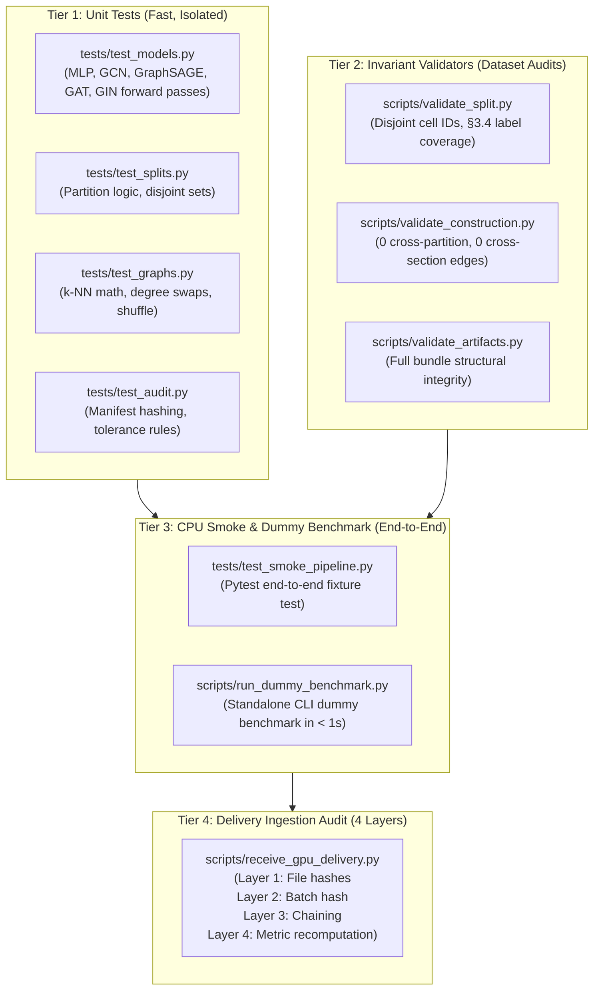

# Testing Guide: Tiers, Smoke Runs & Verification

This document details the 4-tier testing architecture for `spatial-graph-bench`, explaining how unit tests, invariant validators, smoke pipelines, and delivery audits ensure statistical and algorithmic reproducibility.

---

## 1. The 4-Tier Test Architecture



---

## 2. Running Tests Locally

### Tier 1: Fast Unit Tests
Runs isolated unit tests verifying PyTorch/PyG model architectures, seed determinism, preprocessing formulas, and hash chaining:

```bash
# Run all unit tests
uv run pytest -v tests/test_models.py tests/test_splits.py tests/test_graphs.py tests/test_audit.py
```

### Tier 2: Invariant Validation on Real Datasets
Asserts that frozen splits and constructed graph bundles satisfy pre-registered topological constraints:

```bash
# 1. Validate canonical split (zero overlap, 100% test class coverage)
uv run python scripts/validate_split.py splits/merfish_mouse_spinal_cord/mouse_held_out_canonical.json

# 2. Validate spatial graph topology (0 cross-partition edges, 0 cross-section edges)
uv run python scripts/validate_construction.py artifacts/graphs/merfish_mouse_spinal_cord/mouse_held_out_canonical/spatial_knn_k6

# 3. Validate entire artifact bundle (split + features + all 7 graphs)
uv run python scripts/validate_artifacts.py --dataset merfish_mouse_spinal_cord --split mouse_held_out_canonical
```

### Tier 3: CPU Smoke Tests & Dummy Benchmark (< 5 seconds)
These tests execute the entire pipeline (data $\to$ split $\to$ PCA $\to$ graph $\to$ MLP + GCN training $\to$ delivery audit $\to$ matched lift) on synthetic ST fixtures with **zero GPU requirement**:

```bash
# Option A: Standalone CLI Dummy Benchmark (Completes in ~0.60 seconds)
uv run python scripts/run_dummy_benchmark.py
# Or via Makefile:
make test-dummy

# Option B: Pytest Smoke Test Suite
uv run pytest -v tests/test_smoke_pipeline.py
# Or via Makefile:
make smoke-test
```

### Tier 4: Delivery Ingestion Audit
Validates delivered GPU result packages before ingesting into the permanent audit ledger:

```bash
uv run python scripts/receive_gpu_delivery.py gpu_results_merfish_canonical.tar.gz
```

---

## 3. Code Style & Formatter Verification

GitHub Actions CI strictly enforces both linting and formatting across `src`, `tests`, and `scripts`:

```bash
# Check for lint issues
uv run ruff check src tests scripts

# Check for formatting compliance
uv run ruff format --check src tests scripts

# Automatically format and fix issues
make format
# Or manually:
uv run ruff format src tests scripts
uv run ruff check --fix src tests scripts
```

---

## 4. Continuous Integration (CI) Matrix

Every push and pull request triggers our GitHub Actions CI pipeline ([`.github/workflows/ci.yml`](file:///Users/aman/Documents/spatial-graph-bench/.github/workflows/ci.yml)):
- **Matrix**: Python 3.11 and Python 3.12 on `ubuntu-latest`.
- **Steps**:
  1. `uv pip install --system -e ".[dev]"`
  2. `ruff check src tests scripts` (Mandatory lint)
  3. `ruff format --check src tests scripts` (Mandatory format)
  4. `mypy src tests scripts` (Informational typecheck)
  5. `pytest -v tests` (Mandatory 16-test suite)
