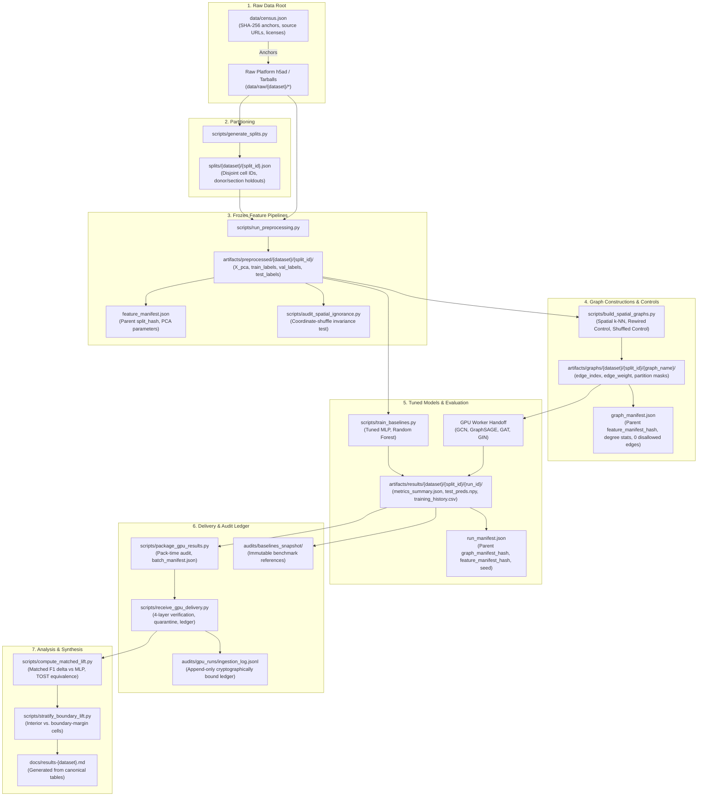

# Cryptographic Provenance Architecture

```mermaid
flowchart TD
    subgraph RawData ["1. Raw Data Root"]
        Census["data/census.json\n(SHA-256 anchors, source URLs, licenses)"]
        RawH5AD["Raw Platform h5ad / Tarballs\n(data/raw/{dataset}/*)"]
        Census -->|Anchors| RawH5AD
    end

    subgraph SplitPhase ["2. Partitioning"]
        SplitGen["scripts/generate_splits.py"]
        SplitJSON["splits/{dataset}/{split_id}.json\n(Disjoint cell IDs, donor/section holdouts)"]
        RawH5AD --> SplitGen
        SplitGen --> SplitJSON
    end

    subgraph PreprocessPhase ["3. Frozen Feature Pipelines"]
        PrepScript["scripts/run_preprocessing.py"]
        PrepBundle["artifacts/preprocessed/{dataset}/{split_id}/\n(X_pca, train_labels, val_labels, test_labels)"]
        FeatManifest["feature_manifest.json\n(Parent split_hash, PCA parameters)"]
        ShuffleAudit["scripts/audit_spatial_ignorance.py\n(Coordinate-shuffle invariance test)"]
        SplitJSON --> PrepScript
        RawH5AD --> PrepScript
        PrepScript --> PrepBundle
        PrepBundle --> FeatManifest
        PrepBundle --> ShuffleAudit
    end

    subgraph ConstructionPhase ["4. Graph Constructions & Controls"]
        GraphBuilders["scripts/build_spatial_graphs.py\n(Spatial k-NN, Rewired Control, Shuffled Control)"]
        GraphBundle["artifacts/graphs/{dataset}/{split_id}/{graph_name}/\n(edge_index, edge_weight, partition masks)"]
        GraphManifest["graph_manifest.json\n(Parent feature_manifest_hash, degree stats, 0 disallowed edges)"]
        PrepBundle --> GraphBuilders
        GraphBuilders --> GraphBundle
        GraphBundle --> GraphManifest
    end

    subgraph TrainingPhase ["5. Tuned Models & Evaluation"]
        TrainBaselines["scripts/train_baselines.py\n(Tuned MLP, Random Forest)"]
        GPUSweep["GPU Worker Handoff\n(GCN, GraphSAGE, GAT, GIN)"]
        RunManifest["run_manifest.json\n(Parent graph_manifest_hash, feature_manifest_hash, seed)"]
        Results["artifacts/results/{dataset}/{split_id}/{run_id}/\n(metrics_summary.json, test_preds.npy, training_history.csv)"]
        GraphBundle --> GPUSweep
        PrepBundle --> TrainBaselines
        TrainBaselines --> Results
        GPUSweep --> Results
        Results --> RunManifest
    end

    subgraph VerificationPhase ["6. Delivery & Audit Ledger"]
        PackGPU["scripts/package_gpu_results.py\n(Pack-time audit, batch_manifest.json)"]
        RecvGPU["scripts/receive_gpu_delivery.py\n(4-layer verification, quarantine, ledger)"]
        IngestionLedger["audits/gpu_runs/ingestion_log.jsonl\n(Append-only cryptographically bound ledger)"]
        BaselinesSnapshot["audits/baselines_snapshot/\n(Immutable benchmark references)"]
        Results --> PackGPU
        PackGPU --> RecvGPU
        RecvGPU --> IngestionLedger
        Results --> BaselinesSnapshot
    end

    subgraph ReportingPhase ["7. Analysis & Synthesis"]
        LiftCompute["scripts/compute_matched_lift.py\n(Matched F1 delta vs MLP, TOST equivalence)"]
        BoundaryAnalysis["scripts/stratify_boundary_lift.py\n(Interior vs. boundary-margin cells)"]
        Reports["docs/results-{dataset}.md\n(Generated from canonical tables)"]
        RecvGPU --> LiftCompute
        LiftCompute --> BoundaryAnalysis
        BoundaryAnalysis --> Reports
    end
```
