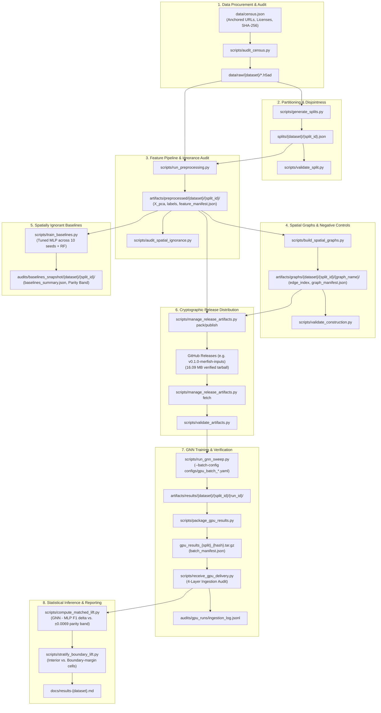

# Scripts Execution Pipeline Flow

This document details the command-line execution sequence for `spatial-graph-bench`, illustrating how each script ingests inputs, asserts cryptographic and topological invariants, and outputs auditable benchmark artifacts.

---

## High-Level Execution Flow



---

## Detailed Script Reference

### 1. `scripts/audit_census.py`
- **Purpose**: Validates local raw dataset files against the immutable registry in `data/census.json`.
- **Inputs**: `data/census.json`, `data/raw/{dataset}/*`
- **Invariants**: SHA-256 hash match, file size verification, license presence.
- **Usage**:
  ```bash
  uv run python scripts/audit_census.py
  ```

### 2. `scripts/generate_splits.py` & `scripts/validate_split.py`
- **Purpose**: Generates donor-held-out or section-held-out splits and asserts disjointness and 100% test label coverage (§3.4).
- **Inputs**: Raw `.h5ad` file, split configuration.
- **Outputs**: `splits/{dataset}/{split_id}.json`
- **Usage**:
  ```bash
  uv run python scripts/generate_splits.py --dataset merfish_mouse_spinal_cord --hierarchy donor_held_out --seed 42
  uv run python scripts/validate_split.py splits/merfish_mouse_spinal_cord/mouse_held_out_canonical.json
  ```

### 3. `scripts/run_preprocessing.py` & `scripts/audit_spatial_ignorance.py`
- **Purpose**: Fits normalization and 50-component PCA strictly on the training partition, saving frozen features, and asserting zero coordinate leakage via the coordinate-shuffle test.
- **Outputs**: `artifacts/preprocessed/{dataset}/{split_id}/`
- **Usage**:
  ```bash
  uv run python scripts/run_preprocessing.py --dataset merfish_mouse_spinal_cord --split mouse_held_out_canonical
  uv run python scripts/audit_spatial_ignorance.py --dataset merfish_mouse_spinal_cord --split mouse_held_out_canonical
  ```

### 4. `scripts/build_spatial_graphs.py` & `scripts/validate_construction.py`
- **Purpose**: Constructs the 7 canonical graph topologies (spatial $k$-NN, degree-preserving rewired controls, coordinate-shuffled controls, bipartite reference) and asserts $0$ cross-partition and $0$ cross-section edges.
- **Outputs**: `artifacts/graphs/{dataset}/{split_id}/{graph_name}/`
- **Usage**:
  ```bash
  uv run python scripts/build_spatial_graphs.py --dataset merfish_mouse_spinal_cord --split mouse_held_out_canonical
  uv run python scripts/validate_construction.py artifacts/graphs/merfish_mouse_spinal_cord/mouse_held_out_canonical/spatial_knn_k6
  ```

### 5. `scripts/train_baselines.py`
- **Purpose**: Trains the spatially ignorant MLP baseline across 10 random seeds (42–51) to compute the empirical parity band ($\pm 2\sigma_{\text{MLP}} = \pm 0.0069$).
- **Outputs**: `audits/baselines_snapshot/{dataset}/{split_id}/baselines_summary.json`
- **Usage**:
  ```bash
  uv run python scripts/train_baselines.py --dataset merfish_mouse_spinal_cord --split mouse_held_out_canonical --num-seeds 10
  ```

### 6. `scripts/manage_release_artifacts.py`
- **Purpose**: Packs, cryptographically signs, publishes to GitHub Releases, and safely downloads/verifies preprocessed inputs on GPU nodes.
- **Usage**:
  ```bash
  # On local CPU node (publish):
  uv run python scripts/manage_release_artifacts.py publish --tag v0.1.0-merfish-inputs

  # On GPU worker node (fetch & verify):
  uv run python scripts/manage_release_artifacts.py fetch --tag v0.1.0-merfish-inputs
  ```

### 7. `scripts/run_gnn_sweep.py` & `scripts/package_gpu_results.py`
- **Purpose**: Runs deterministic GNN training on GPU from YAML batch configs, performs pack-time audits, and outputs delivery tarballs.
- **Usage**:
  ```bash
  PYTHONPATH=src uv run python scripts/run_gnn_sweep.py --batch-config configs/gpu_batch_merfish_canonical.yaml
  uv run python scripts/package_gpu_results.py --dataset merfish_mouse_spinal_cord --split mouse_held_out_canonical --output gpu_results_merfish_canonical.tar.gz
  ```

### 8. `scripts/receive_gpu_delivery.py`
- **Purpose**: Executes 4-layer verification on delivered GPU tarballs (file hashes, aggregate manifest hash, provenance chaining, recomputed metrics) and logs to `audits/gpu_runs/ingestion_log.jsonl`.
- **Usage**:
  ```bash
  PYTHONPATH=src uv run python scripts/receive_gpu_delivery.py gpu_results_merfish_canonical.tar.gz
  ```

### 9. `scripts/run_dummy_benchmark.py`
- **Purpose**: Fast CPU-only smoke test running all 7 stages on synthetic ST data in < 1 second.
- **Usage**:
  ```bash
  uv run python scripts/run_dummy_benchmark.py
  ```
