# Package Architecture & Internal Data Pipeline Flow

This document details the internal module hierarchy and immutable data flow within the core library package `src/spatial_graph_bench/`.

---

## Architectural Component Flow

```mermaid
graph TD
    subgraph ConfigLayer ["1. Configuration & Validation (Pydantic v2)"]
        SplitCfg["config.split.SplitConfig"]
        PrepCfg["config.preprocessing.PreprocessingConfig"]
        GraphCfg["config.graph.SpatialkNNConfig / RewiredControlConfig"]
        ModelCfg["config.model.BenchmarkRunConfig / TrainingConfig"]
    end

    subgraph DataSchemas ["2. Immutable Artifact Schemas"]
        SplitDef["splitting.schema.SplitDefinition\n(train/val/test cell IDs, split_hash)"]
        PrepBundle["preprocessing.schema.PreprocessedBundle\n(X_pca, labels, feature_manifest.json)"]
        GraphBundle["graph.schema.GraphBundle\n(edge_index, edge_weight, graph_manifest.json)"]
        RunManifest["tracking.schema.RunManifest\n(model_name, hyperparameters, parent hashes)"]
    end

    subgraph TransformPipelines ["3. Core Functional Pipelines"]
        SplitGen["splitting.generator.create_split_definition()"]
        PrepPipe["preprocessing.pipeline.run_feature_pipeline()"]
        GraphBuilders["graph.spatial_knn.SpatialkNNGraphBuilder\ngraph.rewired_control.RewiredControlGraphBuilder\ngraph.coordinate_shuffle.CoordinateShuffleGraphBuilder\ngraph.bipartite.BipartiteGraphBuilder"]
    end

    subgraph ModelLayer ["4. Neural & Baseline Architectures"]
        Trainer["models.trainer.run_benchmark_training()"]
        MLP["models.mlp.TunedMLP"]
        GNNs["models.gnn.SpatialGNN\n(GCN, GraphSAGE, GAT, GIN)"]
    end

    subgraph VerificationLayer ["5. Delivery & Statistical Inference"]
        AuditRun["analysis.delivery.audit_run_dir()"]
        BatchManifest["analysis.delivery.BatchManifest"]
        MatchedLift["tracking.graph_lift.compute_matched_graph_lift()"]
        TOST["analysis.tost.two_one_sided_test()"]
    end

    SplitCfg --> SplitGen
    SplitGen --> SplitDef
    SplitDef & PrepCfg --> PrepPipe
    PrepPipe --> PrepBundle

    PrepBundle & GraphCfg --> GraphBuilders
    GraphBuilders --> GraphBundle

    PrepBundle & ModelCfg --> Trainer
    GraphBundle --> Trainer
    Trainer --> MLP
    Trainer --> GNNs
    Trainer --> RunManifest

    RunManifest & PrepBundle & GraphBundle --> AuditRun
    AuditRun --> BatchManifest
    RunManifest --> MatchedLift
    MatchedLift --> TOST
```

---

## Module Hierarchy & Responsibilities

| Module Directory | Primary Classes / Functions | Responsibility |
| :--- | :--- | :--- |
| `spatial_graph_bench.config` | `SplitConfig`, `PreprocessingConfig`, `SpatialkNNConfig`, `BenchmarkRunConfig`, `TrainingConfig` | Strict Pydantic v2 schemas validating all experiment configurations before execution. |
| `spatial_graph_bench.splitting` | `create_split_definition()`, `SplitDefinition` | Deterministic donor/section partition assignment, computing immutable `split_hash`. |
| `spatial_graph_bench.preprocessing` | `run_feature_pipeline()`, `verify_spatial_ignorance()`, `PreprocessedBundle` | Train-only library size norm + HVG + PCA 50; asserts zero spatial leakage via coordinate shuffle. |
| `spatial_graph_bench.graph` | `SpatialkNNGraphBuilder`, `RewiredControlGraphBuilder`, `CoordinateShuffleGraphBuilder`, `BipartiteGraphBuilder`, `GraphBundle` | Generates 7 graph topologies; strictly enforces 0 cross-partition and 0 cross-section edges. |
| `spatial_graph_bench.models` | `TunedMLP`, `SpatialGNN`, `run_benchmark_training()`, `RandomForestWrapper` | PyTorch & PyG neural architectures, early stopping, and standardized evaluation summaries. |
| `spatial_graph_bench.analysis` | `audit_run_dir()`, `build_batch_manifest()`, `verify_batch_files()`, `append_ingestion_log()` | 4-layer delivery verification, audit reports, and tamper-resistant ingestion logging. |
| `spatial_graph_bench.tracking` | `compute_matched_graph_lift()`, `GraphLiftRecord`, `RunManifest` | Cryptographic provenance matching and matched Macro-F1 delta computation against parity bands. |
| `spatial_graph_bench.utils` | `get_logger()`, `setup_logging()`, `compute_sha256()`, `ArtifactPaths`, `set_seed()` | Dual Rich+disk logging, path resolution, cryptographic hashing, and global seed management. |

---

## Cryptographic Chaining Invariants

Every executed run maintains strict cryptographic parent chaining in `run_manifest.json`:
1. `split_hash` $\to$ SHA-256 of `splits/{dataset}/{split_id}.json`
2. `feature_manifest_hash` $\to$ SHA-256 of `artifacts/preprocessed/{dataset}/{split_id}/feature_manifest.json`
3. `graph_manifest_hash` $\to$ SHA-256 of `artifacts/graphs/{dataset}/{split_id}/{graph_name}/graph_manifest.json` (or `null` for spatially ignorant MLP)
4. `run_id` $\to$ Deterministic hash combining dataset, split, model architecture, graph, and seed.

If any upstream file is modified, the downstream run audit will detect a hash mismatch and quarantine the run.
